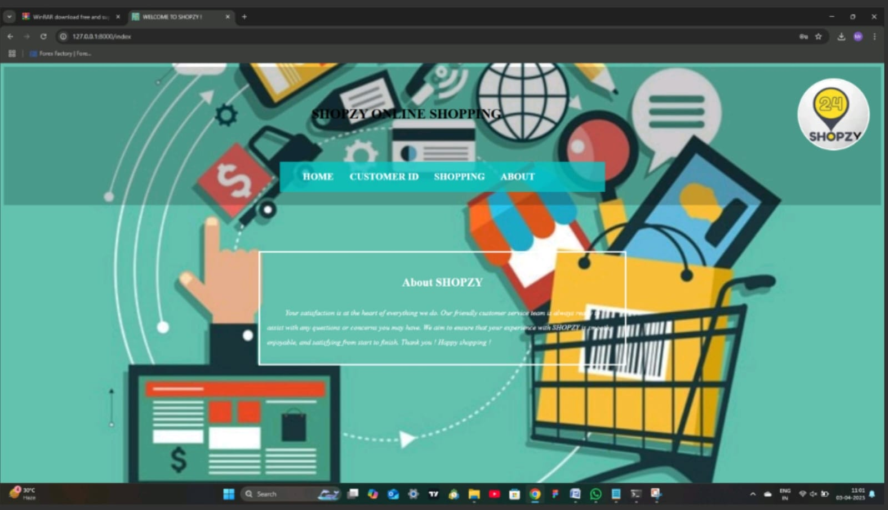
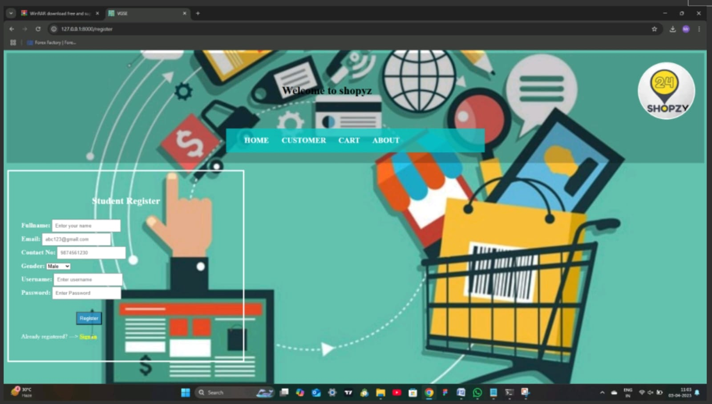
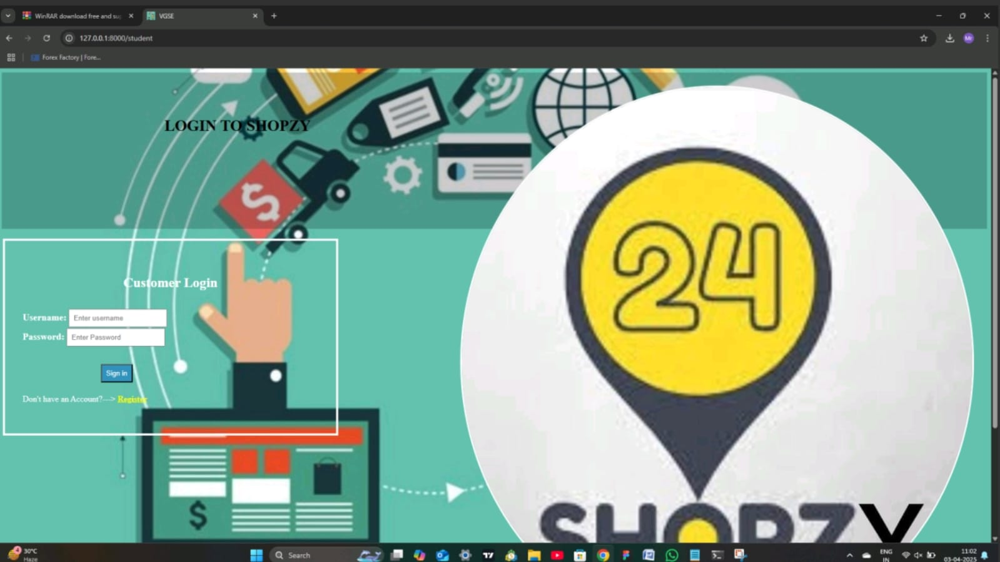
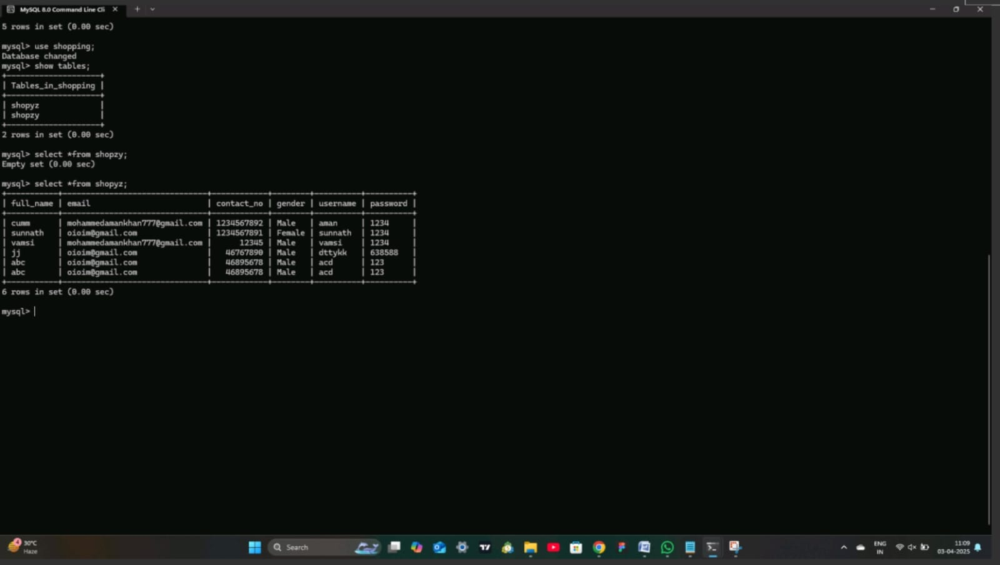

# ecommerce-platform
# E-Commerce Platform (Django)

## Description
This is a simple E-Commerce web application developed using the Django framework.  
The project is created for academic and learning purposes and demonstrates basic backend and frontend integration.

## Features
- User registration
- Product display pages
- Basic navigation between pages
- Simple and clean user interface

## Technologies Used
- Python
- Django
- HTML
- CSS
- SQLite

## Project Structure
- Django project with app configuration
- HTML templates for frontend
- CSS for styling
- SQLite database for data storage

## How to Run the Project
1. Clone or download the repository
2. Make sure Python is installed
3. Install Django:
4. Navigate to the project directory
5. Run the server:
6. Open your browser and visit:
http://127.0.0.1:8000/
## Usage
- Open the home page
- Register a user
- View available pages and content

## Project Type
Academic / Learning Project

## Author
Uploaded by: Ayan
## Screenshots

### Home Page

### Registration Page

### Login Page

### Database View

